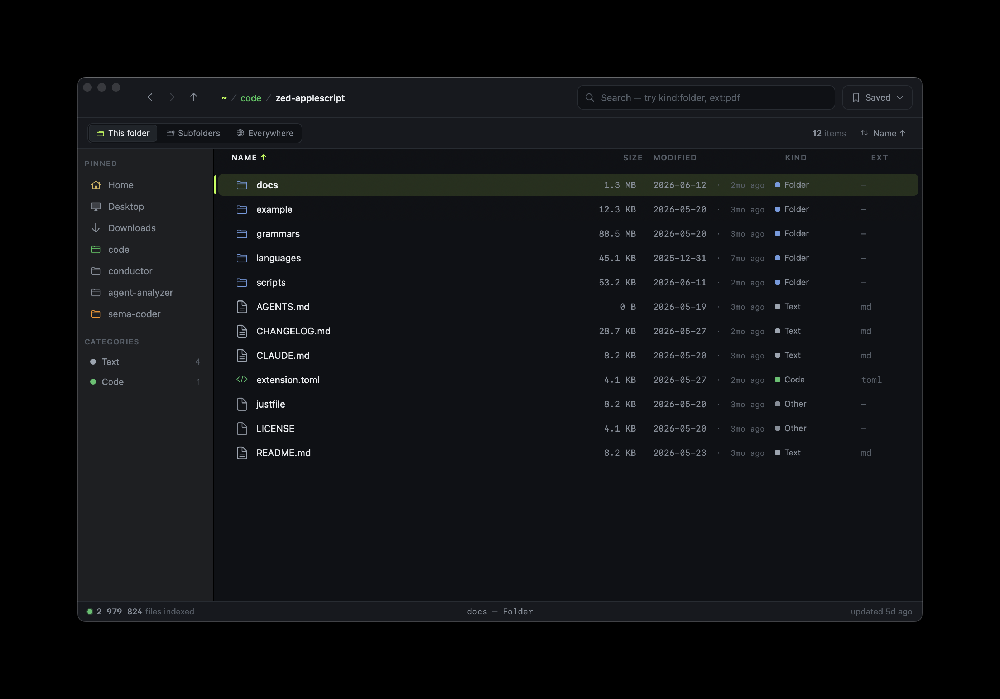
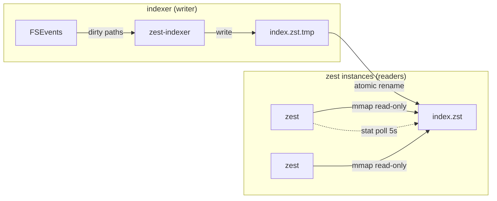
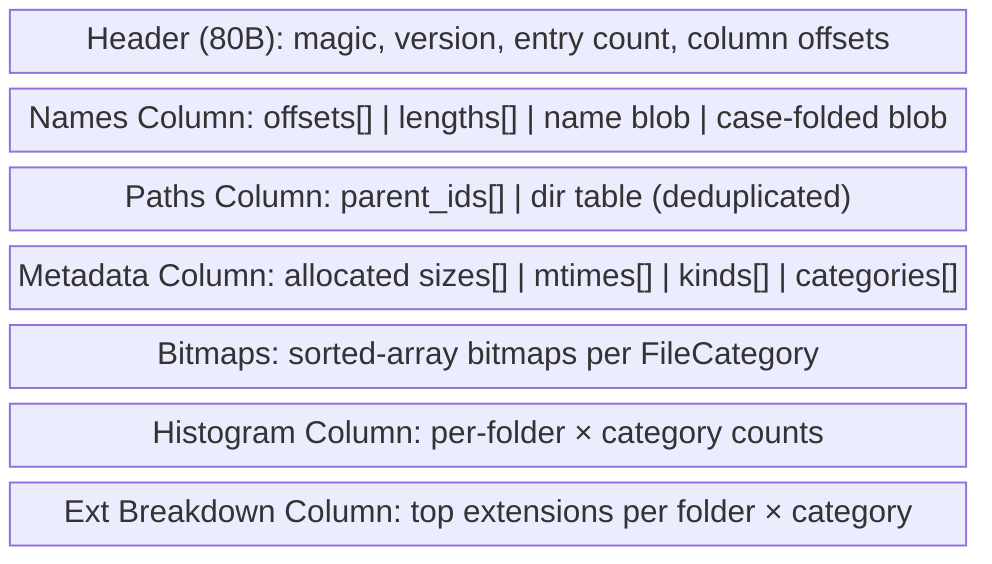
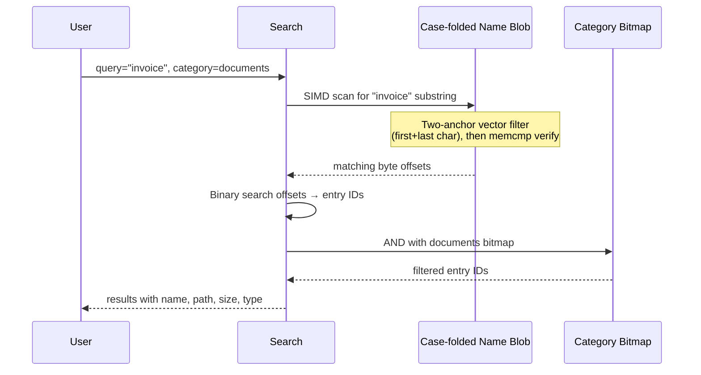
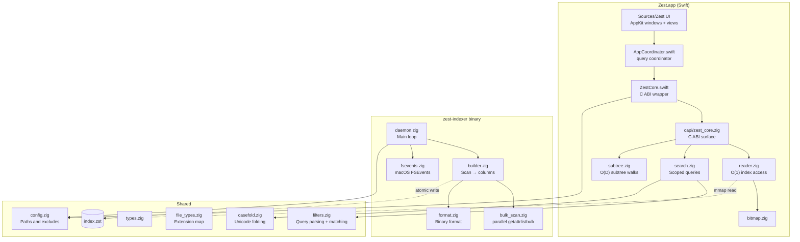

# Zest


<p align="center">
  
</p>

A minimal, fast Finder replacement for macOS. The Swift app (`Sources/Zest/`) links a Zig engine (`libzest-core.a`) via C ABI. The `zest-indexer` binary (Zig) runs as a background daemon keeping the search index up to date.

The app opens a native AppKit window backed entirely by the memory-mapped index:

- A **sidebar** of pinned folders (Home, Desktop, Documents, Downloads by default — add your own) plus a **categories tree** with live counts and per-extension drill-down.
- A **file list** with sortable Name / Size / Modified / Kind / Ext columns, native file icons, and folder sizes that reflect the recursive subtree total.
- A **search field** with qualifier filters — `ext:pdf`, `kind:folder`, `size:>1mb`, `category:images`, and `!` negation — and a scope switch (**This folder / Subfolders / Everywhere**). Browsing and searching are the same mechanism: every list is a single query against the index.
- A **Saved ▾ card:** store the current query under a name and re-apply it with one click; manage or delete saved searches.
- A **file preview** (Space toggles, Esc closes): Markdown, `.sema`, and JSON render with TreeSitter syntax highlighting; arrow keys keep moving the selection underneath.
- **Navigation & chrome:** back / forward / up buttons, an editable breadcrumb (⌘↑ up, ⌘↓ open), and a status bar with indexed-file count, selection summary, and index freshness.
- **View options:** keep folders on top, pin/unpin from the sidebar, per-folder color tags, open in Finder / Terminal, copy path.

## Requirements

- macOS 14+ (Apple Silicon or Intel)
- Zig 0.16.0
- Xcode command line tools (the build invokes `xcrun` to locate the macOS SDK)

## Build & Run

```sh
zig build                        # Build zest-indexer + libzest-core.a
zig build test                   # Run all Zig tests
swift build                      # Build the Swift app (links libzest-core.a)
```

A `justfile` wraps the common workflows:

```sh
just run            # Build everything + swift run Zest (Debug Swift, ReleaseFast engine)
just run-fast       # Build everything + swift run -c release Zest (Release Swift + engine)
just index          # Build the indexer (ReleaseFast) and scan ~
just test           # Run Zig + Swift tests
```

Run `just run` for day-to-day use — it rebuilds the engine in ReleaseFast (Debug engine is ~19× slower on large indices). Use `just run-fast` for a fully optimized build.

## Search Index

Zest uses a custom binary search index instead of SQLite or Spotlight. The index lives at `~/Library/Application Support/zest/index.zst` and is shared across all zest instances via memory-mapped reads.

### Building the index

```sh
# First-time: build the index for your home directory
zig-out/bin/zest-indexer --full-scan ~

# Or install as a launchd daemon (runs on boot, watches for changes)
zig-out/bin/zest-indexer install
```

The indexer scans the filesystem in parallel using macOS `getattrlistbulk` — a fixed worker pool over a shared directory queue, each worker streaming entries to its own temp file. This is ~6.6× faster than a per-file `stat` walk (a ~5.7M-file home directory scans in ~23s). It skips excluded directories (`.git`, `node_modules`, `__pycache__`, `~/Library/Caches`, `~/Library/Developer`, etc.) and writes a columnar binary file.

### Index lifecycle



- **Atomic updates:** The indexer writes to a `.tmp` file, then does an atomic `rename()`. Readers holding the old mmap continue safely — the OS keeps old pages until unmapped.
- **Change detection:** Each zest instance stats the index file every 5 seconds. If the inode changes, it remaps to the new file.
- **FSEvents watcher:** The daemon watches `$HOME` via macOS FSEvents. It coalesces changes and rebuilds when either 1000+ events accumulate or 30 seconds pass since the last event.
- **Daily safety net:** A full rescan runs every 24 hours regardless of events, in case FSEvents misses something.

### Binary format

The index uses a columnar layout designed for fast sequential scanning:



| Column | Purpose |
|--------|---------|
| **Names** | Two copies of concatenated filenames — original case for display, Unicode case-folded for search. The fold is length-preserving, so one `(offset, length)` pair addresses a name in both blobs and O(1) lookup by entry index works for either. |
| **Paths** | Parent directory IDs pointing into a deduplicated directory table. Most files in a directory share one entry, so path storage is compact. |
| **Metadata** | Parallel arrays of allocated sizes (size on disk), modification times, file kinds (file/dir/symlink), and categories. Since format v4 a directory's size is its recursive subtree total, rolled up at build time. |
| **Bitmaps** | One sorted array of entry indices per file category (images, code, documents, etc.). Used for fast intersection with search results. |
| **Histogram** | Per-folder × per-category file counts, in dir-table order. Powers the sidebar categories tree via `zest_histogram`. |
| **Ext Breakdown** | Top extensions (up to 32) per folder × category. Powers the extension drill-down via `zest_ext_breakdown`. |

### How search works

Browsing and searching are one mechanism: the file list is always a single query against the index, parameterized by a **scope** — This folder (depth 1), Subfolders (full subtree), or Everywhere (root scope) — plus free text and qualifier filters (`ext:`, `kind:`, `size:`, `category:`, with `!` negation). An empty query lists the folder's direct children; anything else searches the scope. Text matching itself works like this:



1. The query is Unicode case-*folded* with the same length-preserving fold used when the builder wrote the name blob (`core/casefold.zig`), so `RÉSUMÉ`, `Résumé`, and `résumé` all reduce to one needle
2. A SIMD two-anchor filter checks first + last characters across a whole vector register per step (16 positions on NEON, 32 under AVX2); only survivors get the full `memcmp`
3. Matching byte positions are mapped to entry indices via binary search on the offsets array — entry indices come back monotonic in blob position, which makes duplicate suppression O(1)
4. Category filters intersect with the pre-computed bitmap; other qualifiers (`ext:`, `kind:`, `size:`) match per result
5. Every in-flight query carries a cancel flag polled every 64 KiB of blob, so typing supersedes stale scans instead of queueing behind them
6. **Folder listings** (empty query, depth 1) skip the substring scan: the scope resolves to a directory id and matches the compact parent-id column, so listing a folder in a 5.7M-file index takes ~6ms instead of a full scan
7. Typical text query: ~3–5ms over 1M+ files

### Benchmarking

```sh
just bench-capi      # text-search latency against the real index via C ABI
just bench-search    # synthetic 1M-entry corpus — runs anywhere, no index needed
```

`bench-capi` benchmarks `zest_query` / `zest_histogram` / `zest_ext_breakdown` (the exact C ABI calls the Swift app makes) against the real index: 1 warmup + 7 samples, median reported. `bench-search` builds a deterministic in-memory corpus instead, so engine changes can be measured and compared before/after on any machine. See `benchmarks/bench_capi.zig` and `benchmarks/bench_search.zig` for the harnesses.

## Background Daemon

The `zest-indexer` daemon keeps the index fresh:

```sh
zest-indexer install                    # Install as launchd agent + start
zest-indexer install --binary-path /usr/local/bin/zest-indexer  # Custom path
zest-indexer uninstall                  # Stop + remove launchd agent
zest-indexer --full-scan ~              # One-shot full index build
zest-indexer --full-scan ~/code         # Index a specific subtree
```

When installed, it runs as `dev.zest.indexer` via launchd with `LowPriorityIO` and `Background` process type — minimal impact on system performance.

## File Categories

Zest categorizes files by extension into 8 groups (125+ extensions mapped):

| Category | Extensions |
|----------|-----------|
| Images | png, jpg, gif, webp, svg, heic, bmp, ico, tiff, psd, ... |
| Text | txt, md, rst, log, org, tex |
| Documents | pdf, doc, docx, odt, rtf, pages, epub |
| Spreadsheets | xls, xlsx, csv, ods, numbers, tsv |
| Audio | mp3, wav, aac, flac, ogg, m4a, opus, ... |
| Video | mp4, avi, mov, mkv, webm, ... |
| Code | zig, rs, py, js, ts, go, c, cpp, java, swift, html, css, json, yaml, sh, ... |
| Archives | zip, tar, gz, 7z, rar, zst, dmg, iso, ... |

## Pinned Folders

Default pins: Home, Desktop, Documents, Downloads. User data persists under `~/Library/Application Support/zest/`: `pins.json` (custom pins), `folder_colors.json` (per-folder color tags), and `filters.json` (saved searches).

## Architecture

> The current architecture is documented at [docs/ARCHITECTURE.md](docs/ARCHITECTURE.md) with a self-contained SVG diagram at [docs/architecture.html](docs/architecture.html). The mermaid block below describes the current architecture: the Swift app links `libzest-core.a` and mmaps the same `index.zst` as the indexer daemon.



### Design decisions

- **No SQLite/Spotlight:** Custom mmap'd format delivers single-digit-ms queries over millions of files (SQLite FTS5 with trigrams measures 100–500ms for 1M files).
- **SIMD scan over a case-folded blob:** The lowercase name blob is byte-parallel to the original (folding never changes byte length), so search scans one contiguous blob with a vectorized two-anchor filter (~17 GB/s raw) and recovers entry rows by binary search.
- **Cooperative cancellation:** Each in-flight query carries a cancel flag polled every 64 KiB; the coordinator cancels the previous tick's token so superseded scans unwind instead of hogging the query queue.
- **Parallel `getattrlistbulk` scan:** The indexer reads directory metadata in bulk across a worker pool instead of one `stat` per file — ~6.6× faster on a 5.7M-file tree. (Parallelizing the per-file `stat` walk barely helped; the `std.Io` path serializes, while the raw bulk syscall scales.)
- **C ABI engine boundary:** The Swift app links `libzest-core.a` (built by `zig build core -Doptimize=ReleaseFast`) and calls into the Zig engine via a thin C ABI (`capi/zest_core.zig`). All state for a query session lives in an opaque `ZestHandle` pointer; Swift owns the lifetime.
- **Unmanaged ArrayLists:** Zig 0.16 `std.ArrayList` is unmanaged (allocator passed per-call), which we use throughout.
- **Centralized `Io` handle:** Zig 0.16 routes filesystem, clock, and process access through an `Io` instance handed to `main`. We stash it once in `core/runtime.zig` (alongside small `readFileAlloc`/`writeFileAbsolute`/`ensureDir` helpers) rather than threading it through every signature.
- **Deep modules over shallow ones:** Moved subtree computations out of `IndexReader` into `subtree.zig`. Filter parsing lives with `FilterCriterion` in `filters.zig`. Each module earns its keep by concentrating complexity, not just moving it.

## Project Structure

```
Sources/CZestCore/        # Header-only C module exposing zest_core.h to Swift
Sources/Zest/             # Swift app (AppKit UI + coordination)
├── App/
│   ├── AppCoordinator.swift  # Query coordinator (scope/filter/sort state, result cache, cancellation)
│   ├── AppDelegate.swift     # NSApplicationDelegate + menu bar (⌘↑ up, ⌘↓ open)
│   ├── main.swift            # Entry point
│   └── Snapshot.swift        # Index snapshot value type
├── Core/
│   ├── UserState.swift       # Pins, folder colors, saved filters persistence (JSON)
│   └── ZestCore.swift        # Swift wrapper over the C ABI (mmap owner, query queue)
├── Browser/              # File list table view controller + context menus
├── Sidebar/              # Pinned folders + categories tree with counts
├── Shell/                # Chrome: toolbar, search field, breadcrumb, filter bar,
│                         #   saved-filters card/dialog, preview overlay, status bar
├── Preview/              # Preview content loading + TreeSitter highlighter (md/sema/json)
└── Design/               # Theme, colors, layout constants

src/
├── indexer_main.zig      # Daemon entry point (sets up runtime, delegates to daemon.zig)
├── zest_core_lib.zig     # Library root for libzest-core.a
├── engine.zig            # Module root re-exporting engine modules for out-of-tree imports
├── test_root.zig         # Test root importing all modules with embedded tests
├── core/
│   ├── types.zig          # FileKind, FileCategory, FileEntry, Pin, SearchResult, DirListing
│   ├── file_types.zig     # Extension → category mapping (125+ extensions)
│   ├── filters.zig        # Filter criteria (ext/kind/size/date/category/path) + parsing + matching
│   ├── casefold.zig       # Length-preserving Unicode simple case folding (+ generated data table)
│   ├── humanize.zig       # Human-friendly size / duration / count formatters
│   └── runtime.zig        # Process-wide Io/env handle + file helpers (Zig 0.16)
├── index/
│   ├── format.zig         # Columnar binary index format v7 (header, columns, write)
│   ├── builder.zig        # Drives the scan, parses results, builds the index
│   ├── bulk_scan.zig      # Parallel macOS getattrlistbulk directory scanner
│   ├── reader.zig         # Read-only O(1) index access (names, paths, metadata, bitmaps)
│   ├── subtree.zig        # O(D) subtree walks (histogram, ext breakdown across directories)
│   ├── search.zig         # Scoped query: SIMD substring scan, filters, folder listings
│   ├── bitmap.zig         # Sorted-array bitmaps (AND, OR, contains, iterate)
│   ├── fsevents.zig       # FSEvents C interop wrapper
│   ├── startup.zig        # Daemon startup ordering (watch before scan)
│   └── daemon.zig         # Background indexer: scan, watch, rebuild, launchd
├── capi/
│   └── zest_core.zig      # C ABI over the Zig index engine for the Swift UI
└── config/
    ├── config.zig         # App paths, exclude patterns, directory setup
    └── user_config.zig    # Terminal-candidate resolution

benchmarks/
├── bench_capi.zig         # C ABI regression harness against the real index (`just bench-capi`)
└── bench_search.zig       # Synthetic 1M-entry corpus harness (`just bench-search`)

Tools/
├── EmbedHighlightQueriesTool/  # Build tool embedding TreeSitter highlight queries
└── generate_casefold.py        # Regenerates src/core/casefold_data.zig from Unicode data
```

## Testing

Zig tests are embedded in source files as `test` blocks. Swift tests live in `Sources/ZestTests/`.

```sh
zig build test     # Run all Zig tests via src/test_root.zig
swift test         # Run all Swift tests
```

Zig test coverage:
- File type categorization (extensions, dotfiles, compound extensions)
- Query parsing and filter matching (`ext`/`kind`/`size`/`date`/`category`/`path`, negation)
- Case folding: length preservation over the whole codepoint space, ASCII fast path, invalid UTF-8 passthrough
- Bitmap operations (contains, AND intersection, OR union, iteration)
- Index format roundtrip (write → read, all columns incl. histogram/ext-breakdown) and scan-file parsing
- Search (substring at every vector alignment and blob tail, case-folded matching, qualifier/category filters, scope + depth folder listings, cancellation mid-scan)
- C API (query routing + cancellable variant, histogram depth=1 vs subtree, ext_breakdown per-folder and merged)
- Subtree operations (histogram aggregation, ext breakdown merging)
- Daemon startup ordering (watcher starts before the initial scan)
- Config excludes, terminal-candidate resolution, and humanize formatters

Swift test coverage:
- Filter parsing, query matching, and scope resolution (FilterTests)
- Sorting rules including folders-on-top (SortTests)
- Breadcrumb token building and middle-collapse (BreadcrumbTests)
- Preview state machine, content loading, and TreeSitter highlighting (PreviewStateTests, PreviewContentLoaderTests, TreeSitterHighlighterTests, FilePreviewOverlayTests)
- Theme derivation and color constants (ThemeTests)
- ZestCore C ABI wrapper (ZestCoreTests)
- UserState pins, folder colors, and saved filters persistence (UserStateTests)

The remaining UI layer is exercised by hand, not in the test suite, per project convention.

## License

[MIT](LICENSE)
