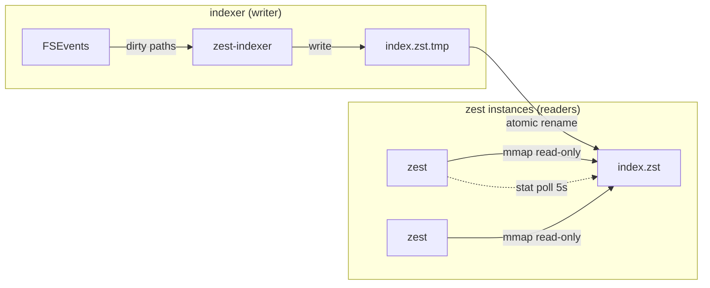
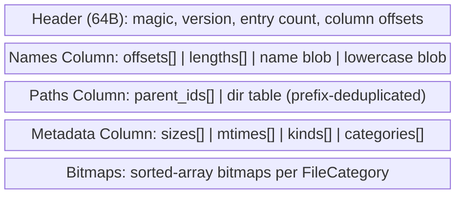
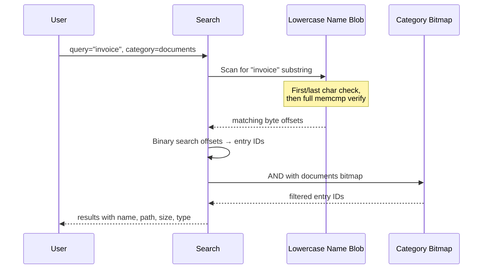
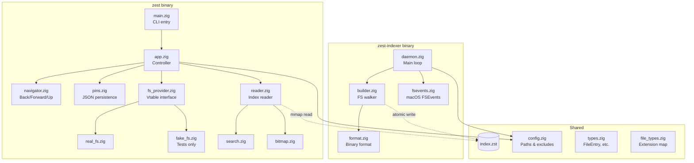

# Zest


A minimal, fast Finder replacement for macOS built in Zig. Two binaries: `zest` (file browser) and `zest-indexer` (background daemon that keeps the search index up to date).

```
$ zest ~/code/zig-finder

  Zest — /Users/helge/code/zig-finder

  Pinned:
    Home         /Users/helge
    Desktop      /Users/helge/Desktop
    Documents    /Users/helge/Documents
    Downloads    /Users/helge/Downloads

  Name                           Size       Type
  ----------------------------------------------------
  📁 src                         --         Other
  📁 docs                        --         Other
  📄 build.zig                   1.8 KB     Code
  📄 README.md                   3.6 KB     Text

  Index: loaded
```

## Requirements

- macOS (Apple Silicon or Intel)
- Zig 0.15.2+

## Build & Run

```sh
zig build                        # Build both binaries → zig-out/bin/{zest,zest-indexer}
zig build run -- .               # Run zest on current directory
zig build run -- ~/Documents     # Run zest on a specific path
zig build test                   # Run all tests (no real FS or UI needed)
```

## Search Index

Zest uses a custom binary search index instead of SQLite or Spotlight. The index lives at `~/Library/Application Support/zest/index.zst` and is shared across all zest instances via memory-mapped reads.

### Building the index

```sh
# First-time: build the index for your home directory
zig-out/bin/zest-indexer --full-scan ~

# Or install as a launchd daemon (runs on boot, watches for changes)
zig-out/bin/zest-indexer install
```

The indexer walks the filesystem, skipping excluded directories (`.git`, `node_modules`, `.Trash`, `__pycache__`, `Library/Caches`, etc.), and writes a columnar binary file.

### Index lifecycle



- **Atomic updates:** The indexer writes to a `.tmp` file, then does an atomic `rename()`. Readers holding the old mmap continue safely — the OS keeps old pages until unmapped.
- **Change detection:** Each zest instance stats the index file every 5 seconds. If the inode changes, it remaps to the new file.
- **FSEvents watcher:** The daemon watches `$HOME` via macOS FSEvents. It coalesces changes and rebuilds when either 1000+ events accumulate or 30 seconds pass since the last event.
- **Daily safety net:** A full rescan runs every 24 hours regardless of events, in case FSEvents misses something.

### Binary format

The index uses a columnar layout designed for fast sequential scanning:



| Column | Purpose |
|--------|---------|
| **Names** | Two copies of concatenated filenames — original case for display, lowercase for search. Offsets and lengths arrays allow O(1) lookup by entry index. |
| **Paths** | Parent directory IDs pointing into a deduplicated directory table. Most files in a directory share one entry, so path storage is compact. |
| **Metadata** | Parallel arrays of sizes, modification times, file kinds (file/dir/symlink), and categories. |
| **Bitmaps** | One sorted array of entry indices per file category (images, code, documents, etc.). Used for fast intersection with search results. |

### How search works



1. The query is lowercased, then scanned against the lowercase name blob
2. For each position, a first-char + last-char check provides a fast reject before full `memcmp`
3. Matching byte positions are mapped to entry indices via binary search on the offsets array
4. If a category filter is active, results are intersected with the pre-computed bitmap
5. Typical query time: <5ms for 1M files

### Benchmarking

```sh
zig build run -- --benchmark "invoice"
```

Runs the query 1000 times against the loaded index and prints p50/p99 latency in microseconds.

## Background Daemon

The `zest-indexer` daemon keeps the index fresh:

```sh
zest-indexer install                    # Install as launchd agent + start
zest-indexer install --binary-path /usr/local/bin/zest-indexer  # Custom path
zest-indexer uninstall                  # Stop + remove launchd agent
zest-indexer --full-scan ~              # One-shot full index build
zest-indexer --full-scan ~/code         # Index a specific subtree
```

When installed, it runs as `dev.zest.indexer` via launchd with `LowPriorityIO` and `Background` process type — minimal impact on system performance.

## File Categories

Zest categorizes files by extension into 8 groups (80+ extensions mapped):

| Category | Extensions |
|----------|-----------|
| Images | png, jpg, gif, webp, svg, heic, bmp, ico, tiff, psd, ... |
| Text | txt, md, rst, log, org, tex |
| Documents | pdf, doc, docx, odt, rtf, pages, epub |
| Spreadsheets | xls, xlsx, csv, ods, numbers, tsv |
| Audio | mp3, wav, aac, flac, ogg, m4a, opus, ... |
| Video | mp4, avi, mov, mkv, webm, ... |
| Code | zig, rs, py, js, ts, go, c, cpp, java, swift, html, css, json, yaml, sh, ... |
| Archives | zip, tar, gz, 7z, rar, zst, dmg, iso, ... |

## Pinned Folders

Default pins: Home, Desktop, Documents, Downloads. Custom pins are persisted to `~/Library/Application Support/zest/pins.json`.

## Architecture



### Design decisions

- **No SQLite/Spotlight:** Custom mmap'd format delivers sub-5ms queries. SQLite FTS5 with trigrams is 100-500ms for 1M files.
- **Vtable FS interface:** Same `ptr + vtable` pattern as `std.mem.Allocator`. `FakeFs` enables fast, deterministic tests with no disk I/O.
- **ObjC runtime bridge:** Direct `@cImport("objc/runtime.h")` with typed `objc_msgSend` wrappers — no external dependencies for AppKit interop.
- **Unmanaged ArrayLists:** Zig 0.15.2 `std.ArrayList` is unmanaged (allocator passed per-call), which we use throughout.

## Project Structure

```
src/
├── main.zig              # CLI entry point, arg parsing, --benchmark
├── indexer_main.zig      # Daemon entry point (delegates to daemon.zig)
├── app.zig               # Application controller (navigator + pins + index + FS)
├── test_root.zig         # Test root importing all modules
├── core/
│   ├── types.zig          # FileEntry, FileKind, FileCategory, Pin, DirListing
│   ├── fs_provider.zig    # FileSystemProvider vtable interface
│   ├── real_fs.zig        # Real filesystem implementation
│   ├── fake_fs.zig        # In-memory fake for tests
│   ├── file_types.zig     # Extension → category mapping (80+ extensions)
│   ├── navigator.zig      # Path navigation with back/forward/up history
│   └── pins.zig           # Pin manager with JSON persistence
├── index/
│   ├── format.zig         # Binary index format (header, columns, write)
│   ├── builder.zig        # Walks filesystem, builds index via format.zig
│   ├── reader.zig         # Read-only index access (names, paths, metadata, bitmaps)
│   ├── search.zig         # Substring search over name blob + bitmap filtering
│   ├── bitmap.zig         # Sorted-array bitmaps (AND, OR, contains, iterate)
│   ├── fsevents.zig       # FSEvents C interop wrapper
│   └── daemon.zig         # Background indexer: scan, watch, rebuild, launchd
├── ui/
│   ├── theme.zig          # Darcula dark theme color constants
│   ├── objc.zig           # ObjC runtime bridge (msgSend wrappers, NSString)
│   └── appkit.zig         # AppKit UI (stub — CLI fallback for now)
└── config/
    └── config.zig         # App paths, exclude patterns, directory setup
```

## Testing

All tests use `FakeFs` (in-memory filesystem) — no real disk I/O, no UI. Tests are embedded in source files as Zig `test` blocks.

```sh
zig build test     # Run all tests via src/test_root.zig
```

Test coverage:
- File type categorization (extensions, edge cases, dotfiles, compound extensions)
- Bitmap operations (contains, AND intersection, OR union, iteration)
- Index format roundtrip (write → read, verify all columns)
- Search correctness (substring, case-insensitive, category filter, empty query, no results)
- Pin manager (JSON roundtrip, add/remove, duplicate detection, malformed JSON)
- Navigator (back/forward/up, root boundary, forward stack clearing)
- ObjC bridge (selector lookup, class lookup, NSObject lifecycle, NSString roundtrip)

## License

[MIT](LICENSE)
