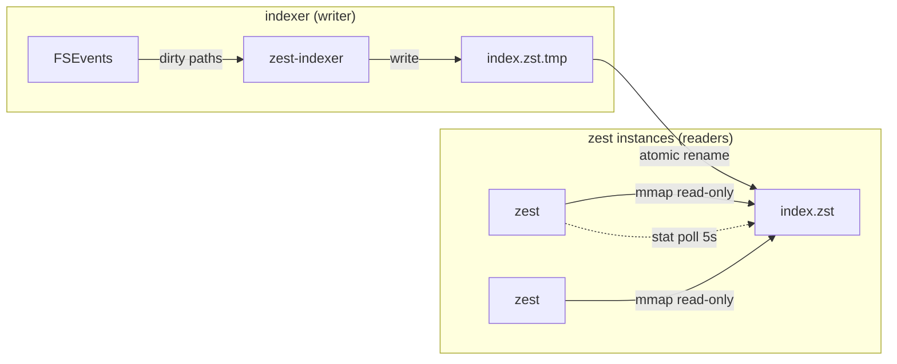
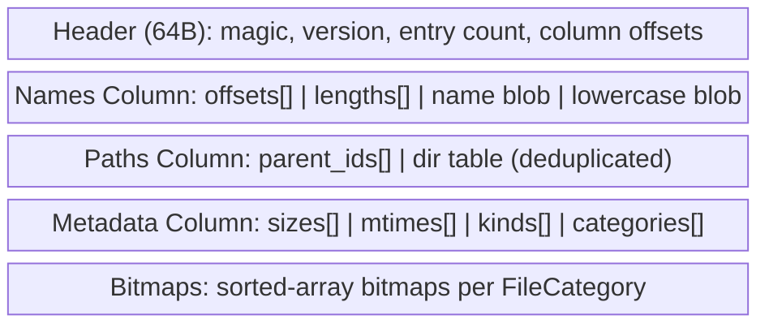
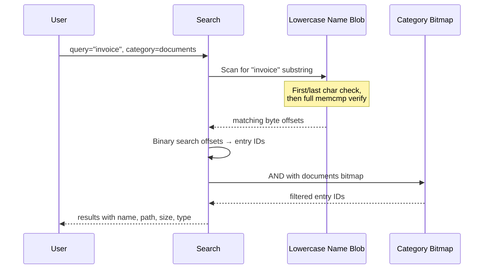
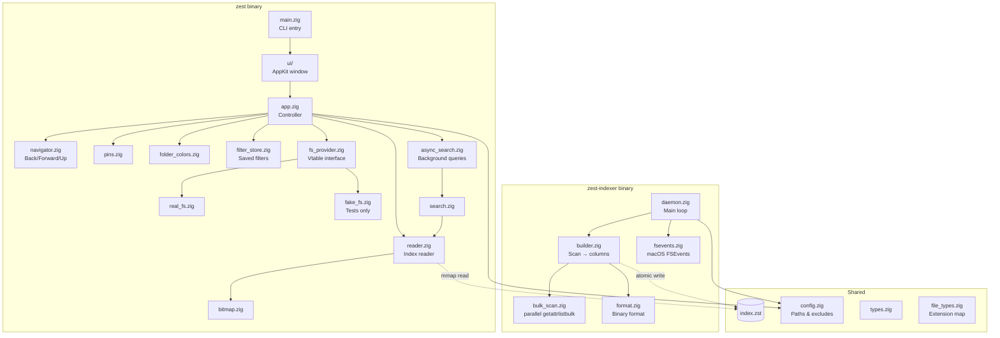

# Zest


A minimal, fast Finder replacement for macOS built in Zig. Two binaries: `zest` (native file browser) and `zest-indexer` (background daemon that keeps the search index up to date).

`zest <path>` opens a native AppKit window backed entirely by the memory-mapped index:

- A **sidebar** of pinned folders (Home, Desktop, Documents, Downloads by default — add your own).
- A **file list** with sortable Name / Size / Date / Type columns and native file icons.
- A **search field** with qualifier filters — `ext:pdf`, `kind:folder`, `size:>1mb`, `category:images`, and `!` negation — that searches the current folder's subtree.
- **View options:** keep folders on top, show full paths, per-folder color tags, open in terminal, pin/unpin, save filters.

Browsing and searching are the same mechanism: every list is a single query against the index.

## Requirements

- macOS (Apple Silicon or Intel)
- Zig 0.16.0
- Xcode command line tools (the build invokes `xcrun` to locate the macOS SDK)

## Build & Run

```sh
zig build                        # Build both binaries → zig-out/bin/{zest,zest-indexer}
zig build run -- .               # Run zest on the current directory (Debug)
zig build test                   # Run all tests (no real FS or UI needed)
```

A `justfile` wraps the common workflows:

```sh
just run            # Build + run (Debug — fast to compile)
just run-fast       # Build + run in ReleaseFast (folder switching ~6ms vs ~80ms Debug)
just index          # Build the indexer (ReleaseFast) and scan ~
just dev            # Build everything ReleaseFast, scan ~, then launch
just test           # Run tests
```

Run in **ReleaseFast** (`just run-fast`) for real use — it's dramatically snappier than a Debug build.

## Search Index

Zest uses a custom binary search index instead of SQLite or Spotlight. The index lives at `~/Library/Application Support/zest/index.zst` and is shared across all zest instances via memory-mapped reads.

### Building the index

```sh
# First-time: build the index for your home directory
zig-out/bin/zest-indexer --full-scan ~

# Or install as a launchd daemon (runs on boot, watches for changes)
zig-out/bin/zest-indexer install
```

The indexer scans the filesystem in parallel using macOS `getattrlistbulk` — a fixed worker pool over a shared directory queue, each worker streaming entries to its own temp file. This is ~6.6× faster than a per-file `stat` walk (a ~5.7M-file home directory scans in ~24s). It skips excluded directories (`.git`, `node_modules`, `__pycache__`, `~/Library/Caches`, `~/Library/Developer`, etc.) and writes a columnar binary file.

### Index lifecycle



- **Atomic updates:** The indexer writes to a `.tmp` file, then does an atomic `rename()`. Readers holding the old mmap continue safely — the OS keeps old pages until unmapped.
- **Change detection:** Each zest instance stats the index file every 5 seconds. If the inode changes, it remaps to the new file.
- **FSEvents watcher:** The daemon watches `$HOME` via macOS FSEvents. It coalesces changes and rebuilds when either 1000+ events accumulate or 30 seconds pass since the last event.
- **Daily safety net:** A full rescan runs every 24 hours regardless of events, in case FSEvents misses something.

### Binary format

The index uses a columnar layout designed for fast sequential scanning:



| Column | Purpose |
|--------|---------|
| **Names** | Two copies of concatenated filenames — original case for display, lowercase for search. Offsets and lengths arrays allow O(1) lookup by entry index. |
| **Paths** | Parent directory IDs pointing into a deduplicated directory table. Most files in a directory share one entry, so path storage is compact. |
| **Metadata** | Parallel arrays of sizes, modification times, file kinds (file/dir/symlink), and categories. |
| **Bitmaps** | One sorted array of entry indices per file category (images, code, documents, etc.). Used for fast intersection with search results. |

### How search works

Browsing and searching are one mechanism: the file list is always a single query against the index, parameterized by a **scope** (the current folder) and a **depth**. An empty query lists the folder's direct children (depth 1); typing free text or a qualifier filter (`ext:`, `kind:`, `size:`, `category:`, with `!` negation) searches the whole subtree under the scope. Text matching itself works like this:



1. The query is lowercased, then scanned against the lowercase name blob
2. For each position, a first-char + last-char check provides a fast reject before full `memcmp`
3. Matching byte positions are mapped to entry indices via binary search on the offsets array
4. Category filters intersect with the pre-computed bitmap; other qualifiers (`ext:`, `kind:`, `size:`) match per result
5. **Folder listings** (empty query, depth 1) skip the substring scan: the scope resolves to a directory id and matches the compact parent-id column, so listing a folder in a 5.7M-file index takes ~6ms instead of a full scan
6. Typical text query: ~3–5ms over 1M+ files

### Benchmarking

```sh
zig build run -- --benchmark "invoice"          # text-search latency, p50/p99 over 1000 runs (µs)
zig build run -- --benchmark-list ~/Documents   # folder-listing latency, p50/p99 (ms)
just bench "invoice"                             # same, built ReleaseFast
```

`--benchmark` runs a text query 1000 times against the loaded index; `--benchmark-list` times a depth-1 folder listing (what the UI runs on every folder switch).

## Background Daemon

The `zest-indexer` daemon keeps the index fresh:

```sh
zest-indexer install                    # Install as launchd agent + start
zest-indexer install --binary-path /usr/local/bin/zest-indexer  # Custom path
zest-indexer uninstall                  # Stop + remove launchd agent
zest-indexer --full-scan ~              # One-shot full index build
zest-indexer --full-scan ~/code         # Index a specific subtree
```

When installed, it runs as `dev.zest.indexer` via launchd with `LowPriorityIO` and `Background` process type — minimal impact on system performance.

## File Categories

Zest categorizes files by extension into 8 groups (80+ extensions mapped):

| Category | Extensions |
|----------|-----------|
| Images | png, jpg, gif, webp, svg, heic, bmp, ico, tiff, psd, ... |
| Text | txt, md, rst, log, org, tex |
| Documents | pdf, doc, docx, odt, rtf, pages, epub |
| Spreadsheets | xls, xlsx, csv, ods, numbers, tsv |
| Audio | mp3, wav, aac, flac, ogg, m4a, opus, ... |
| Video | mp4, avi, mov, mkv, webm, ... |
| Code | zig, rs, py, js, ts, go, c, cpp, java, swift, html, css, json, yaml, sh, ... |
| Archives | zip, tar, gz, 7z, rar, zst, dmg, iso, ... |

## Pinned Folders

Default pins: Home, Desktop, Documents, Downloads. Custom pins are persisted to `~/Library/Application Support/zest/pins.json`.

## Architecture

> The current architecture is documented at [docs/ARCHITECTURE.md](docs/ARCHITECTURE.md) with a self-contained SVG diagram at [docs/architecture.html](docs/architecture.html). The mermaid block below describes the legacy Zig UI; the Swift app links `libzest-core.a` (a static lib with the same reader + search code shown here) and mmaps the same `index.zst`.



### Design decisions

- **No SQLite/Spotlight:** Custom mmap'd format delivers sub-5ms queries. SQLite FTS5 with trigrams is 100-500ms for 1M files.
- **Parallel `getattrlistbulk` scan:** The indexer reads directory metadata in bulk across a worker pool instead of one `stat` per file — ~6.6× faster on a 5.7M-file tree. (Parallelizing the per-file `stat` walk barely helped; the `std.Io` path serializes, while the raw bulk syscall scales.)
- **Vtable FS interface:** Same `ptr + vtable` pattern as `std.mem.Allocator`. `FakeFs` enables fast, deterministic tests with no disk I/O.
- **ObjC runtime bridge:** Direct `@cImport("objc/runtime.h")` with typed `objc_msgSend` wrappers — no external dependencies for AppKit interop.
- **Unmanaged ArrayLists:** Zig 0.16 `std.ArrayList` is unmanaged (allocator passed per-call), which we use throughout.
- **Centralized `Io` handle:** Zig 0.16 routes filesystem, clock, and process access through an `Io` instance handed to `main`. We stash it once in `core/runtime.zig` (alongside small `readFileAlloc`/`writeFileAbsolute`/`ensureDir` helpers) rather than threading it through every signature — the same global-state pattern the UI uses for `delegate.state`.

## Project Structure

```
src/
├── main.zig              # CLI entry: arg parsing, --benchmark / --benchmark-list, launches the GUI
├── indexer_main.zig      # Daemon entry point (sets up runtime, delegates to daemon.zig)
├── app.zig               # App controller (navigator, pins, folder colors, saved filters, index reader)
├── test_root.zig         # Test root importing all modules with embedded tests
├── core/
│   ├── types.zig          # FileKind, FileCategory, FileEntry, Pin, SearchResult, DirListing
│   ├── fs_provider.zig    # FileSystemProvider vtable interface
│   ├── real_fs.zig        # Real filesystem implementation (isDir/openFile)
│   ├── fake_fs.zig        # In-memory fake for tests
│   ├── file_types.zig     # Extension → category mapping (80+ extensions)
│   ├── navigator.zig      # Path navigation with back/forward/up history
│   ├── pins.zig           # Pinned folders, JSON persistence
│   ├── folder_colors.zig  # Per-folder color tags, JSON persistence
│   ├── filters.zig        # Filter criteria (ext/kind/size/category) + matching
│   ├── query_parser.zig   # Parse a query string into free text + qualifier filters
│   ├── filter_store.zig   # Saved/named filters, JSON persistence
│   ├── async_search.zig   # Background search coordinator (threads + GCD delivery)
│   ├── humanize.zig       # Human-friendly size / duration / count formatters
│   └── runtime.zig        # Process-wide Io/env handle + file helpers (Zig 0.16)
├── index/
│   ├── format.zig         # Columnar binary index format (header, columns, write)
│   ├── builder.zig        # Drives the scan, parses results, builds the index
│   ├── bulk_scan.zig      # Parallel macOS getattrlistbulk directory scanner
│   ├── reader.zig         # Read-only index access (names, paths, metadata, bitmaps)
│   ├── search.zig         # Scoped query: substring search, filters, sort, folder listings
│   ├── bitmap.zig         # Sorted-array bitmaps (AND, OR, contains, iterate)
│   ├── fsevents.zig       # FSEvents C interop wrapper
│   └── daemon.zig         # Background indexer: scan, watch, rebuild, launchd
├── ui/                    # Native AppKit UI (GitHub Dark theme)
│   ├── appkit.zig         # App bootstrap (NSApplication + run loop)
│   ├── delegate.zig       # AppState + ObjC callbacks (table/sidebar/menus/actions)
│   ├── window.zig         # Window, toolbar, split view, main menu
│   ├── file_list.zig      # NSTableView file list
│   ├── sidebar.zig        # Pinned-folders sidebar
│   ├── icons.zig          # File icons (NSWorkspace)
│   ├── theme.zig          # GitHub Dark theme color constants
│   └── objc.zig           # ObjC runtime bridge (msgSend wrappers, NSString)
└── config/
    ├── config.zig         # App paths, exclude patterns, directory setup
    └── user_config.zig    # ~/.config/zest/config.json (e.g. preferred terminal)
```

## Testing

All tests use `FakeFs` (in-memory filesystem) — no real disk I/O, no UI. Tests are embedded in source files as Zig `test` blocks.

```sh
zig build test     # Run all tests via src/test_root.zig
```

Test coverage:
- File type categorization (extensions, dotfiles, compound extensions)
- Query parsing and filter matching (`ext`/`kind`/`size`/`category`, negation)
- Saved filters and folder colors (JSON roundtrip)
- Bitmap operations (contains, AND intersection, OR union, iteration)
- Index format roundtrip (write → read, all columns) and scan-file parsing
- Search (substring, case-insensitive, qualifier/category filters, scope + depth folder listings, column sort incl. folders-on-top)
- Pin manager and navigator (history, root boundary, forward-stack clearing)
- Config excludes, terminal-candidate resolution, and humanize formatters

The UI layer (`ui/*`) is exercised by hand, not in the test suite, per project convention.

## License

[MIT](LICENSE)
