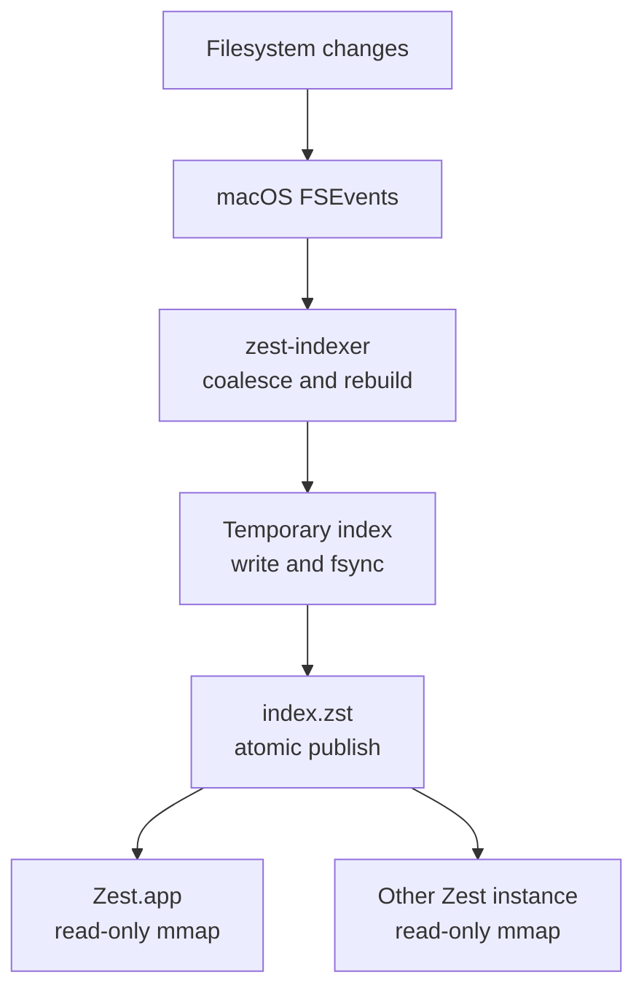
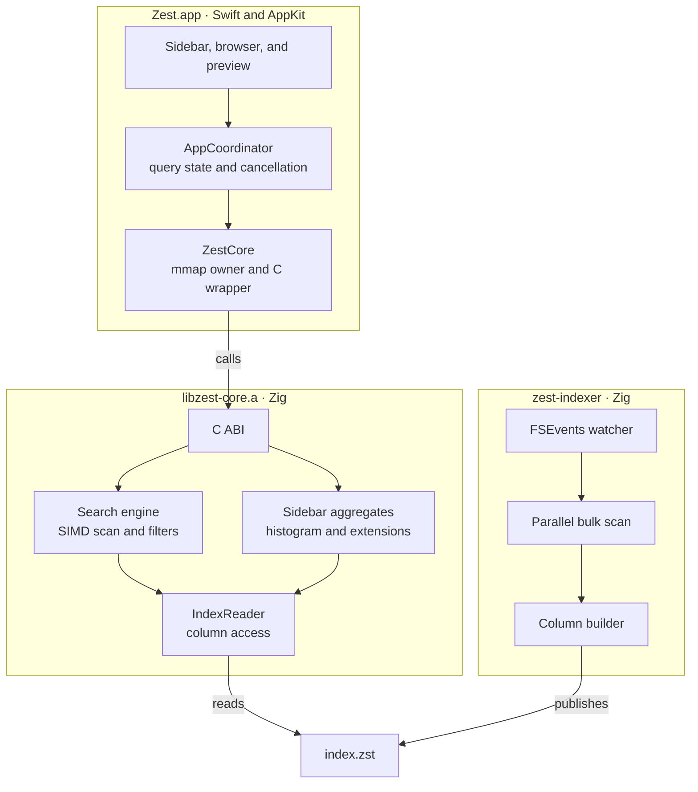
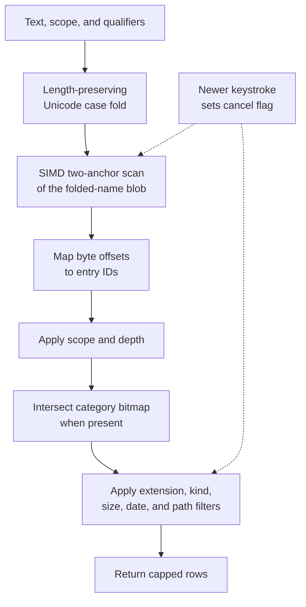

# Zest


<p align="center">
  
</p>

Zest is a fast, keyboard-friendly Finder alternative for macOS. A native AppKit app presents files from a custom memory-mapped index, while a Zig engine handles scanning, search, filters, and sidebar aggregates.

- Browse and search millions of files through the same scoped query interface.
- Filter by extension, kind, size, date, category, or path.
- Sort by name, size, modification date, kind, or extension.
- Preview Markdown, `.sema`, and JSON with TreeSitter highlighting.
- Pin folders, apply color tags, and save reusable searches.
- Keep the index current with a low-priority launchd daemon.

## Quick start

### Install the beta

Download the [0.1.1 signed, notarized Universal installer](https://github.com/HelgeSverre/zest/releases/download/v0.1.1/zest-universal-apple-darwin.pkg), or use Homebrew:

```sh
brew install --cask helgesverre/tap/zest
```

Open Zest from Applications, then choose **Index > Set Up Indexer**. Installing
does not start a scan. Full Disk Access and background approval are guided in the
app. Requires macOS 14 or newer, on Apple Silicon or Intel. See the
[0.1.1 beta notes](docs/releases/0.1.1.md) for fixes and known limitations.
Homebrew exposes `zest`, `zest-query`, and `zest-indexer` in your terminal; a direct
PKG installation keeps those binaries inside the app bundle. `zest .` or
`zest ~/Downloads` opens a new window in that folder; each invocation is its
own process.

### Update or switch to Homebrew

Disable background indexing from the Index menu and quit Zest before upgrading
or uninstalling. Your index and preferences are retained. There is no automatic updater.

For an existing **Homebrew-managed** installation:

```sh
brew update
brew upgrade --cask zest
```

If you installed the PKG directly, either install the newer PKG over the existing
app or switch to Homebrew with `brew install --cask helgesverre/tap/zest`.
**“Cask 'zest' is not installed”** means Homebrew does not manage the app—even if
`/Applications/Zest.app` exists. Use `brew install`, not `brew upgrade`, in that case.
After updating, reopen Zest and use the Index menu to start indexing or complete setup.

### Build from source

- macOS 14 or later, on Apple Silicon or Intel.
- Zig 0.16.0
- Xcode 26.3 (the compiler used by CI; the app still runs on macOS 14+)
- [`just`](https://github.com/casey/just) for the supported development commands

Build the first index, then launch the app:

```sh
just index
just dev
```

For a fully optimized Swift build, use `just run`. To keep the index updated in the background:

```sh
just daemon-install
```

This installs the separate **development** daemon. Do not run it alongside the
packaged app's indexer; manage that service from the app's Index menu instead.

> Use the `just` recipes after changing Zig code. SwiftPM does not track the external `libzest-core.a` archive, so the recipes explicitly rebuild and relink the current ReleaseFast engine.

## Using Zest

The file list is always the result of one query. An empty query browses the selected folder; adding text or qualifiers searches within the active scope.

| Scope | Searches |
|---|---|
| **This folder** | Direct children of the current folder |
| **Subfolders** | The current folder and its full subtree |
| **Everywhere** | The complete index |

### Search qualifiers

Plain text and qualifiers can be combined in any order. Qualifiers are ANDed, except positive extension filters, which form an OR group.

| Query | Meaning |
|---|---|
| `invoice` | Filename contains `invoice` |
| `ext:pdf` | PDF files |
| `ext:pdf,docx` | PDF or DOCX files |
| `kind:folder` | Directories only; `file` and `symlink` are also supported |
| `size:>10mb` | Larger than 10 MiB; comparisons and `1mb..20mb` ranges work |
| `date:week` | Modified in the last week; also `today`, `month`, `year`, dates, and ranges |
| `cat:images` | Files in the Images category |
| `path:projects` | Parent path contains `projects` |
| `!ext:log` | Exclude `.log` files |

For example, `report cat:documents !ext:pdf size:>1mb` finds large non-PDF documents whose names contain `report`.

### Navigation and state

- `⌘F` focuses search; `⌘1` and `⌘2` focus the sidebar and file list.
- `⌘↑` goes up; `⌘↓` opens the selected item.
- Space toggles preview and Escape closes it.
- The breadcrumb is editable, with back, forward, and up navigation.
- The sidebar provides default pins, live category counts, and extension drill-downs.

Pins, folder colors, and saved searches live under `~/Library/Application Support/zest/` in `pins.json`, `folder_colors.json`, and `filters.json`.

<details>
<summary>File categories</summary>

Zest maps more than 125 extensions into eight groups, plus Uncategorized.

| Category | Example extensions |
|---|---|
| Images | png, jpg, gif, webp, svg, heic, tiff, psd |
| Text | txt, md, rst, log, org, tex |
| Documents | pdf, doc, docx, odt, rtf, pages, epub |
| Spreadsheets | xls, xlsx, csv, ods, numbers, tsv |
| Audio | mp3, wav, aac, flac, ogg, m4a, opus |
| Video | mp4, avi, mov, mkv, webm |
| Code | zig, rs, py, js, ts, go, c, cpp, swift, json, yaml |
| Archives | zip, tar, gz, 7z, rar, zst, dmg, iso |

</details>

## The search index

Zest uses a custom columnar index instead of SQLite or Spotlight. The index lives at `~/Library/Application Support/zest/index.zst`; every app instance opens it with a read-only mmap.

The indexer uses macOS `getattrlistbulk` with a fixed worker pool. Each worker streams scan records to a separate temporary file, avoiding a per-file `stat` walk and shared-output contention. Excluded trees include `.git`, `node_modules`, `__pycache__`, `~/Library/Caches`, and `~/Library/Developer`.

### Index lifecycle



- **Atomic publication:** the daemon writes and syncs a unique temporary file, then renames it over `index.zst`. Existing mmaps remain valid until their readers release them.
- **Reload detection:** each app instance checks the index inode every five seconds and remaps when it changes.
- **Event coalescing:** pending changes rebuild once 30 seconds have passed since the previous build, or immediately when 1,000 events accumulate.
- **Safety net:** the daemon performs a full rescan every 24 hours.

The native **Index** menu shows whether the launchd indexer is running, stopped,
waiting to start, or not installed. It offers **Re-index Now**, **Stop Indexer**,
and **Restart Indexer** while running, **Start Indexer** while stopped, and
**Set Up Indexer…** when absent. Starting always performs a full scan.
Development builds offer **Locate Indexer…** if the helper is missing; packaged
releases use only their bundled helper. A missing macOS registration record with
a valid bundle offers setup. Genuine status failures expose **Show Status Error…**.
Menu operations run in the background and report failures.

In 0.1.1 and newer, check the packaged service without starting the GUI or a scan:

```sh
zest --indexer-status
# Direct PKG installation, without Homebrew's terminal links:
/Applications/Zest.app/Contents/MacOS/Zest --indexer-status
```

This prints `not_installed`, `stopped`, `running`, `waiting`, or `requiresApproval`.
Failures report the underlying error on stderr and exit nonzero.

All three commands (`zest`, `zest-query`, `zest-indexer`) accept `--help` and
`--version`; the version comes from `release.json` at build time. Invalid
arguments print `NAME: error: ...` on stderr and exit 2.

Packaged releases use a bundled **SMAppService** LaunchAgent. Setup explicitly
migrates an existing development daemon; app launch alone does not install or
start one. macOS background-item approval is shown separately from Full Disk
Access. **Stop Indexer** and **Disable Background Indexing…** unregister the
packaged service, including at future logins. The CLI lifecycle described below
is retained for development builds. See [the release runbook](docs/RELEASE.md)
for Universal PKG packaging, signing, installation, and removal.

Development menu installation first stages the indexer without registering or starting it.
The packaged app uses its own bundled executable instead of copying one.
The native SwiftUI guide has three distinct panels: Welcome, Enable Access, and
Ready to Index. It includes buttons to open **System Settings → Privacy & Security →
Full Disk Access**, copy the installed helper path, and reveal it in Finder.
Add that executable and enable its switch. The guide polls access automatically;
click **Done** once verified, or **Skip for now** and confirm to start without verification. Closing
setup leaves the indexer unregistered, so it will not start unexpectedly at login.
For an existing installation, **Set Up Full Disk Access…** pauses indexing and
stages the current helper and opens the same guide; closing that guide leaves
the existing daemon stopped.

UI tests render all five onboarding states (welcome, access, waiting, verified,
and unavailable) using the actual native window without probing permissions or
starting the daemon. To save those captures, set `ZEST_ONBOARDING_SNAPSHOT_DIR`
to an output directory when running `swift test --filter IndexerMenuTests`.

### First-index progress

Until the first usable index is loaded, Zest shows a native progress overlay with
discovery counts, elapsed time, a sampled current folder, and the current phase.
Scanning and building are indeterminate; saving reports actual bytes written,
not an estimated overall percentage. The overlay closes only after the new index
is opened and the first query returns. **Run in background** hides it; the status
bar reopens it. Later rebuilds leave the existing index usable and only update
the status bar. Interrupted scans offer retry and access-setup actions.

The indexer writes private (`0600`), atomically replaced `progress-*.json` records
in its excluded support directory. A dedicated heartbeat updates long-running
phases once per second, without per-file IPC or writes on scan worker threads.
Records include a run ID and PID; the app checks liveness and freshness, ignores
malformed/oversized records, and does not confuse a stopped writer with success.
Telemetry failures never prevent index publication. Successful one-shot scans
remove their progress record; the daemon retains its last result. Both `just index`
and daemon scans report progress. Existing development helpers must be updated via
**Index → Set Up Full Disk Access…** (or `just daemon-install`) to emit it.

Set `ZEST_PROGRESS_SNAPSHOT_DIR` when running `swift test --filter IndexProgressTests`
to capture native overlay states at the app's minimum size without starting a scan.

macOS requires the user to enable Full Disk Access in System Settings; there is
no public one-click permission prompt or reliable public authorization query.
The guide launches a fresh, short-lived instance of the installed helper through
launchd every few seconds to test directory access to Safari, Mail, or Messages
(falling back only when a directory is absent). It does not read file contents or
inspect the privacy database. This verifies a protected-folder operation, not the
system's Full Disk Access switch or access to every folder. Denied, missing, or
inconclusive results never enable Done. Closing the guide stops polling.
Starting without granting access may still produce separate folder prompts. Full Disk Access is
broader than folder-specific consent and can expose protected app data; scanner
exclusions remain in effect. Development builds are ad-hoc signed, so replacing
the executable may require granting access again. Packaged releases use a stable
Developer ID signing identity. Development CLI
`install` remains an explicit install-and-start command;
`prepare-install` only stages the executable for permission setup.

Development CLI installation copies the helper to
`~/Library/Application Support/zest/bin/zest-indexer`, so development builds and
`just clean` do not remove the installed executable. Run `just daemon-install`
again after changing daemon code to update that copy. Diagnostics go to
`~/Library/Application Support/zest/daemon.log`. Stopping unloads the job for
the current login session; it starts again at the next login. Use
`just daemon-uninstall` to remove automatic startup (index and user data remain).

The **development daemon** controls are also available from the CLI (these do
not report or control the packaged app's SMAppService registration):

```sh
./zig-out/bin/zest-indexer status
./zig-out/bin/zest-indexer reindex
./zig-out/bin/zest-indexer stop
./zig-out/bin/zest-indexer start
./zig-out/bin/zest-indexer restart
./zig-out/bin/zest-indexer --help
```

Re-index requests are queued for the existing daemon, including requests arriving
during a scan. Failed builds preserve the last good index and retry after 5, 10,
20 seconds, up to a five-minute delay. Scanning and filesystem-event handling
share exclusions, including hidden trees and Zest's own output directory.
Each scan uses unique intermediate files, so overlapping development scans do
not overwrite each other's shards; the last successful publication wins.

Run `just test-daemon` (requires Node.js) for live FSEvents, forced re-index,
failure recovery, exclusion-churn, and overlapping-scan checks in a temporary
home. Zig tests also validate plist round-trips with macOS's parser and exercise
launchd lifecycle/failure handling under a disposable service label when a GUI
login domain is available.

Use `just index` for a one-off home-directory scan. The indexer can also target another subtree:

```sh
zig build indexer -Doptimize=ReleaseFast
./zig-out/bin/zest-indexer --full-scan ~/code
```

### Querying the index from the command line

`zest-query` is a read-only wrapper over the same memory-mapped index and query
engine as the app. It emits TSV, so its output can be sorted, filtered, or
redirected without scanning the filesystem again.

Homebrew installs `zest-query` on PATH. See the [CLI and coding-agent guide](docs/ZEST-QUERY.md)
for discovery examples, TSV parsing, limits, exit codes, and stale-index caveats.

```sh
just query-build
./zig-out/bin/zest-query --scope "$HOME" --depth 1 --sort size --desc
./zig-out/bin/zest-query 'size:>1gb kind:file' --depth all --sort size --desc
./zig-out/bin/zest-query 'date:week size:>100mb' --depth all --sort mtime --desc
```

The default scope is `$HOME`, the default depth is direct children, and the
default output limit is 50 rows. Use `--help` for all options. Results only
include paths present in the index. The standard home scan excludes `.git`,
`node_modules`, `__pycache__`, `~/Library/Caches`, and
`~/Library/Developer`, so use a filesystem tool when investigating those paths.

### On-disk format

The current writer emits format v7. The reader also accepts layout-compatible v6 indexes during an app/daemon rolling upgrade, using the v6 ASCII fold until a v7 rebuild is published.

| Column | Contents and purpose |
|---|---|
| Header | 80-byte header with magic, version, entry count, timestamps, and section offsets |
| Names | Offsets, lengths, display-name blob, and a length-preserving Unicode-folded blob |
| Paths | Parent IDs and a deduplicated directory table |
| Metadata | Allocated sizes, modification times, file kinds, and categories |
| Bitmaps | Sorted entry-index arrays for category filtering |
| Histogram | Per-folder category counts for the sidebar |
| Extension breakdown | Top extensions per folder and category |

The parallel arrays make entry lookup cheap, while the contiguous folded-name blob gives the search engine one sequential region to scan.

## Architecture

The Swift app owns presentation and user state. Zig owns the index format, filesystem scan, query parser, search engine, and aggregate calculations. A small C ABI is the boundary between them.



Detailed architecture notes live in [docs/ARCHITECTURE.md](docs/ARCHITECTURE.md); [docs/architecture.html](docs/architecture.html) contains a standalone visual overview.

### Query pipeline



The query and index use the same length-preserving Unicode fold, so matches map directly back to the original name blob. The SIMD filter compares the first and last query bytes across a vector before verifying survivors with `memcmp`. Matching blob positions are monotonic, which makes duplicate suppression O(1). Cancellation is polled every 64 KiB during text scans and every 512 entries during filter-only scans.

### Design choices

- **Columnar mmap format:** minimizes pointer chasing and keeps the text-search hot path sequential.
- **ReleaseFast Zig engine:** even Debug Swift builds link the optimized search core.
- **C ABI boundary:** Swift owns UI lifetimes; the Zig library stays synchronous, CPU-only, and independent of the daemon runtime.
- **Cooperative cancellation:** a new keystroke stops the superseded scan instead of waiting behind it on the serial query queue.
- **Precomputed aggregates:** folder sizes, category histograms, and extension breakdowns are written once and reused by the UI.

## Development

### Common commands

| Command | Purpose |
|---|---|
| `just build` | Build Zig binaries, the ReleaseFast core, and the Swift app |
| `just dev` | Run Debug Swift with the ReleaseFast engine |
| `just run` | Run optimized Swift and Zig builds |
| `just index` | Rebuild the home-directory index once |
| `just query-build` | Build the read-only `zest-query` CLI |
| `just daemon-install` | Install and start the launchd indexer |
| `just daemon-uninstall` | Stop and remove the launchd indexer |
| `just test` | Run Zig and Swift tests with the current core linked |
| `just test-ui` | Run the headless AppKit UI tests against the local index |
| `just lint` | Compile-check and lint both languages |
| `just format` | Format Zig and Swift sources |
| `just bench-search` | Benchmark a deterministic one-million-entry corpus |
| `just bench-capi` | Benchmark the C ABI against the real index |

### Repository map

| Path | Responsibility |
|---|---|
| `Sources/Zest/` | Native AppKit UI, coordination, previews, and persisted user state |
| `Sources/CZestCore/` | Clang-imported public C header for the Zig library |
| `src/core/` | Shared types, filters, case folding, categories, and runtime helpers |
| `src/index/` | Scanner, format, reader, search, subtree aggregates, and daemon |
| `src/capi/` | C ABI consumed by Swift |
| `src/config/` | Paths, exclusions, and terminal selection |
| `benchmarks/` | Synthetic engine and real-index C ABI benchmarks |
| `Tools/` | Case-fold generation and embedded TreeSitter query tooling |

### Testing

`just test` runs embedded Zig tests and the Swift XCTest suite. Coverage includes index round-trips and corruption handling, Unicode folding, SIMD boundary cases, query filters, cancellation, subtree aggregation, C ABI marshaling, sorting, navigation, persisted state, previews, and highlighting.

UI tests (`just test-ui`, also part of `just test`) drive the real window in-process: `Sources/ZestTests/UIHarness.swift` builds `RootViewController` in an off-screen `NSWindow`, locates views by their `A11y` accessibility identifiers, and sends real `NSEvent` key and mouse events through the responder chain, so typing, Esc, ⌘↑, double-click, sidebar and scope-chip clicks are asserted against coordinator state and the visible cells. No XCUITest and no Accessibility permission is needed; the tests skip when there is no index.

The remaining AppKit interaction layer (drag and drop, Quick Look, context menus) is verified manually. Benchmark harnesses report medians over deterministic synthetic data or the current real index, making performance changes easy to compare before and after.

## License

[MIT](LICENSE)
