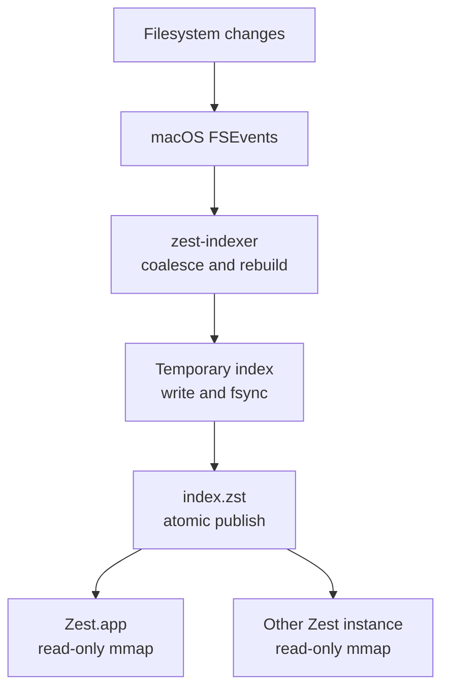
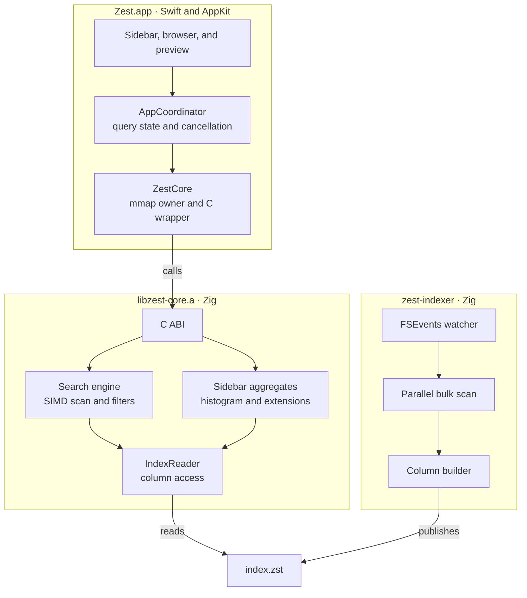
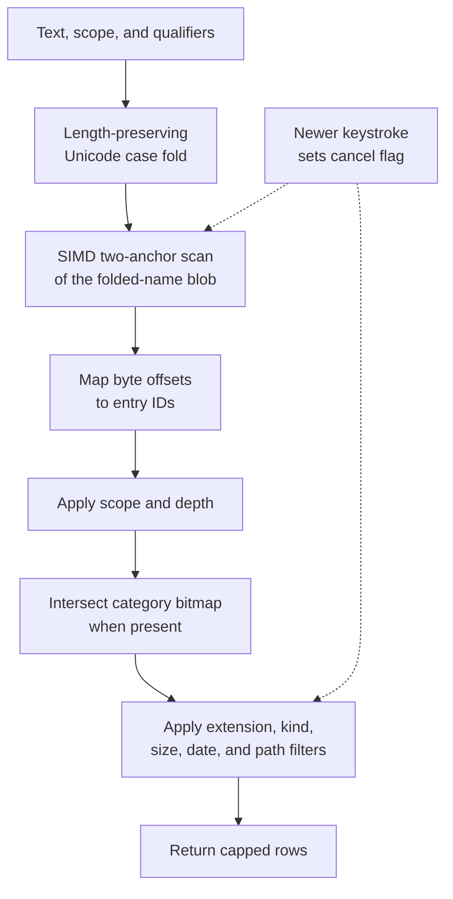

# Zest


<p align="center">
  
</p>

Zest is a fast, keyboard-friendly Finder alternative for macOS. A native AppKit app presents files from a custom memory-mapped index, while a Zig engine handles scanning, search, filters, and sidebar aggregates.

- Browse and search millions of files through the same scoped query interface.
- Filter by extension, kind, size, date, category, or path.
- Sort by name, size, modification date, kind, or extension.
- Preview Markdown, `.sema`, and JSON with TreeSitter highlighting.
- Pin folders, apply color tags, and save reusable searches.
- Keep the index current with a low-priority launchd daemon.

## Quick start

### Requirements

- macOS 14 or later, on Apple Silicon or Intel
- Zig 0.16.0
- Xcode Command Line Tools
- [`just`](https://github.com/casey/just) for the supported development commands

Build the first index, then launch the app:

```sh
just index
just run
```

For a fully optimized Swift build, use `just run-fast`. To keep the index updated in the background:

```sh
just install-daemon
```

> Use the `just` recipes after changing Zig code. SwiftPM does not track the external `libzest-core.a` archive, so the recipes explicitly rebuild and relink the current ReleaseFast engine.

## Using Zest

The file list is always the result of one query. An empty query browses the selected folder; adding text or qualifiers searches within the active scope.

| Scope | Searches |
|---|---|
| **This folder** | Direct children of the current folder |
| **Subfolders** | The current folder and its full subtree |
| **Everywhere** | The complete index |

### Search qualifiers

Plain text and qualifiers can be combined in any order. Qualifiers are ANDed, except positive extension filters, which form an OR group.

| Query | Meaning |
|---|---|
| `invoice` | Filename contains `invoice` |
| `ext:pdf` | PDF files |
| `ext:pdf,docx` | PDF or DOCX files |
| `kind:folder` | Directories only; `file` and `symlink` are also supported |
| `size:>10mb` | Larger than 10 MiB; comparisons and `1mb..20mb` ranges work |
| `date:week` | Modified in the last week; also `today`, `month`, `year`, dates, and ranges |
| `cat:images` | Files in the Images category |
| `path:projects` | Parent path contains `projects` |
| `!ext:log` | Exclude `.log` files |

For example, `report cat:documents !ext:pdf size:>1mb` finds large non-PDF documents whose names contain `report`.

### Navigation and state

- `⌘F` focuses search; `⌘1` and `⌘2` focus the sidebar and file list.
- `⌘↑` goes up; `⌘↓` opens the selected item.
- Space toggles preview and Escape closes it.
- The breadcrumb is editable, with back, forward, and up navigation.
- The sidebar provides default pins, live category counts, and extension drill-downs.

Pins, folder colors, and saved searches live under `~/Library/Application Support/zest/` in `pins.json`, `folder_colors.json`, and `filters.json`.

<details>
<summary>File categories</summary>

Zest maps more than 125 extensions into eight groups, plus Uncategorized.

| Category | Example extensions |
|---|---|
| Images | png, jpg, gif, webp, svg, heic, tiff, psd |
| Text | txt, md, rst, log, org, tex |
| Documents | pdf, doc, docx, odt, rtf, pages, epub |
| Spreadsheets | xls, xlsx, csv, ods, numbers, tsv |
| Audio | mp3, wav, aac, flac, ogg, m4a, opus |
| Video | mp4, avi, mov, mkv, webm |
| Code | zig, rs, py, js, ts, go, c, cpp, swift, json, yaml |
| Archives | zip, tar, gz, 7z, rar, zst, dmg, iso |

</details>

## The search index

Zest uses a custom columnar index instead of SQLite or Spotlight. The index lives at `~/Library/Application Support/zest/index.zst`; every app instance opens it with a read-only mmap.

The indexer uses macOS `getattrlistbulk` with a fixed worker pool. Each worker streams scan records to a separate temporary file, avoiding a per-file `stat` walk and shared-output contention. Excluded trees include `.git`, `node_modules`, `__pycache__`, `~/Library/Caches`, and `~/Library/Developer`.

### Index lifecycle



- **Atomic publication:** the daemon writes and syncs a unique temporary file, then renames it over `index.zst`. Existing mmaps remain valid until their readers release them.
- **Reload detection:** each app instance checks the index inode every five seconds and remaps when it changes.
- **Event coalescing:** pending changes rebuild once 30 seconds have passed since the previous build, or immediately when 1,000 events accumulate.
- **Safety net:** the daemon performs a full rescan every 24 hours.

Use `just index` for a one-off home-directory scan. The indexer can also target another subtree:

```sh
zig build indexer -Doptimize=ReleaseFast
./zig-out/bin/zest-indexer --full-scan ~/code
```

### On-disk format

The current writer emits format v7. The reader also accepts layout-compatible v6 indexes during an app/daemon rolling upgrade, using the v6 ASCII fold until a v7 rebuild is published.

| Column | Contents and purpose |
|---|---|
| Header | 80-byte header with magic, version, entry count, timestamps, and section offsets |
| Names | Offsets, lengths, display-name blob, and a length-preserving Unicode-folded blob |
| Paths | Parent IDs and a deduplicated directory table |
| Metadata | Allocated sizes, modification times, file kinds, and categories |
| Bitmaps | Sorted entry-index arrays for category filtering |
| Histogram | Per-folder category counts for the sidebar |
| Extension breakdown | Top extensions per folder and category |

The parallel arrays make entry lookup cheap, while the contiguous folded-name blob gives the search engine one sequential region to scan.

## Architecture

The Swift app owns presentation and user state. Zig owns the index format, filesystem scan, query parser, search engine, and aggregate calculations. A small C ABI is the boundary between them.



Detailed architecture notes live in [docs/ARCHITECTURE.md](docs/ARCHITECTURE.md); [docs/architecture.html](docs/architecture.html) contains a standalone visual overview.

### Query pipeline



The query and index use the same length-preserving Unicode fold, so matches map directly back to the original name blob. The SIMD filter compares the first and last query bytes across a vector before verifying survivors with `memcmp`. Matching blob positions are monotonic, which makes duplicate suppression O(1). Cancellation is polled every 64 KiB during text scans and every 512 entries during filter-only scans.

### Design choices

- **Columnar mmap format:** minimizes pointer chasing and keeps the text-search hot path sequential.
- **ReleaseFast Zig engine:** even Debug Swift builds link the optimized search core.
- **C ABI boundary:** Swift owns UI lifetimes; the Zig library stays synchronous, CPU-only, and independent of the daemon runtime.
- **Cooperative cancellation:** a new keystroke stops the superseded scan instead of waiting behind it on the serial query queue.
- **Precomputed aggregates:** folder sizes, category histograms, and extension breakdowns are written once and reused by the UI.

## Development

### Common commands

| Command | Purpose |
|---|---|
| `just build` | Build Zig binaries, the ReleaseFast core, and the Swift app |
| `just run` | Run Debug Swift with the ReleaseFast engine |
| `just run-fast` | Run optimized Swift and Zig builds |
| `just index` | Rebuild the home-directory index once |
| `just install-daemon` | Install and start the launchd indexer |
| `just uninstall-daemon` | Stop and remove the launchd indexer |
| `just test` | Run Zig and Swift tests with the current core linked |
| `just lint` | Compile-check and lint both languages |
| `just format` | Format Zig and Swift sources |
| `just bench-search` | Benchmark a deterministic one-million-entry corpus |
| `just bench-capi` | Benchmark the C ABI against the real index |

### Repository map

| Path | Responsibility |
|---|---|
| `Sources/Zest/` | Native AppKit UI, coordination, previews, and persisted user state |
| `Sources/CZestCore/` | Clang-imported public C header for the Zig library |
| `src/core/` | Shared types, filters, case folding, categories, and runtime helpers |
| `src/index/` | Scanner, format, reader, search, subtree aggregates, and daemon |
| `src/capi/` | C ABI consumed by Swift |
| `src/config/` | Paths, exclusions, and terminal selection |
| `benchmarks/` | Synthetic engine and real-index C ABI benchmarks |
| `Tools/` | Case-fold generation and embedded TreeSitter query tooling |

### Testing

`just test` runs embedded Zig tests and the Swift XCTest suite. Coverage includes index round-trips and corruption handling, Unicode folding, SIMD boundary cases, query filters, cancellation, subtree aggregation, C ABI marshaling, sorting, navigation, persisted state, previews, and highlighting.

The remaining AppKit interaction layer is verified manually. Benchmark harnesses report medians over deterministic synthetic data or the current real index, making performance changes easy to compare before and after.

## License

[MIT](LICENSE)
